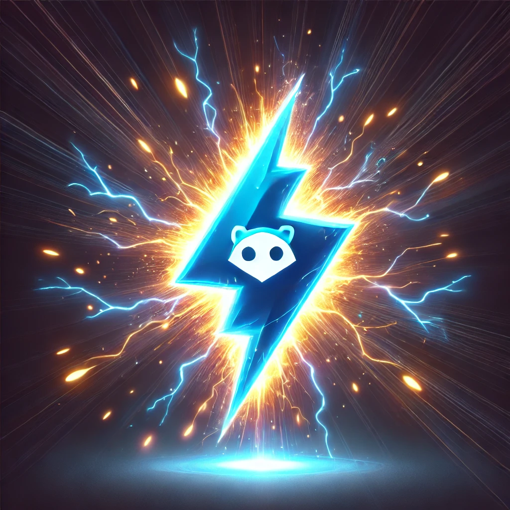

# go-node-native

<div align="center">

</div>

This project aims to demonstrate the integration of Go and Node.js using native modules. It combines the power of Go for performance-critical tasks and Node.js for its extensive ecosystem and ease of development.

## Table of Contents

- [Project Structure](#project-structure)
- [Getting Started](#getting-started)
- [Usage](#usage)
- [License](#license)

## Project Structure

The project's directory structure is as follows:

```
go-node-native/
├── go-native/
│   ├── Makefile
│   ├── example.d.ts
│   ├── index.js
│   ├── main.go
│   ├── package.json
│   ├── .nvmrc
│   ├── LICENSE
│   └── shared/
├── go.mod
├── index.js
├── .nvmrc
├── LICENSE
└── package.json
```

## Getting Started

1. Install Node.js and Go on your system.
2. Clone this repository: `git clone https://github.com/abhisekp/go-node-native.git`
3. Navigate to the project directory: `cd go-node-native`
4. Install project dependencies:
  - For Node.js: `npm install`
  - For Go: `go mod download`

## Usage

To run the project, execute the following command in the project directory:

```bash
npm start
```

This will start the Node.js cli app and execute the Go code using the native module. The output will be displayed in the console.

## Test

Uses `node:test` module to write the test cases.

```bash
npm test
```

## License

This project is licensed under the MIT License. 

See the [LICENSE](./LICENSE) file for more details.

## Contributing

See [CONTRIBUTING](./CONTRIBUTING.md)
